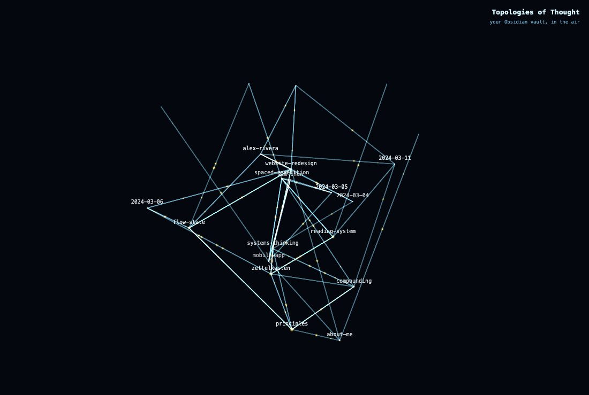

# Obsidian-hologram-tracker

A **Jarvis-style holographic interface for your Obsidian vault.** Your notes
become a living 3D neural network that floats in front of you, anchored to your
face through your webcam, and that you control with your bare hands.

Built with vanilla JS + Three.js + MediaPipe. No build step, no framework, no
backend — open one local page and your second brain is in the air in front of you.

> Inspired by the "Topologies of Thoughts" idea: a graph where nodes are notes
> and edges are labelled by how the ideas connect.



> _Above: the bundled demo vault. With a webcam, the whole constellation anchors to
> your face and you move it with your hands._

---

## What it does

- **Reads your Obsidian vault** → every note is a node, every `[[wikilink]]` an
  edge. Unresolved links become *ghost nodes* (exactly like Obsidian's own graph
  view), so the projects/ideas you reference but haven't written yet still show up
  as hubs.
- **Tracks your face** (MediaPipe Face Mesh) and draws a glowing wireframe of it,
  with the whole constellation anchored to your head.
- **Tracks your hands** (MediaPipe Hands) so you can grab, move, scale and explore
  the graph in the air — like Tony Stark.
- **Animated like neurons**: signals travel along the connections and nodes flash
  in chain reactions as the "thought" propagates.

## Demo

Clone it and run — it ships with a small **demo vault** so you see it working
before connecting your own notes:

```bash
git clone https://github.com/<you>/Obsidian-hologram-tracker.git
cd Obsidian-hologram-tracker
python3 serve.py 8123          # any static server over http works
# open http://localhost:8123 and allow the camera
```

> A camera needs a *secure context*, so it must be served over `http://localhost`
> (or https). Opening `index.html` with a double-click will **not** work.

> _For the full effect, drop a webcam screenshot (the graph over your face) into
> `docs/` and swap it into the image at the top — that's the real pitch._

## Connect your own Obsidian vault

```bash
# Option A — one-off:
node scan-vault.mjs "/absolute/path/to/your/Vault"

# Option B — remember your path (recommended):
cp .vault-path.example .vault-path
#   then edit .vault-path with your vault's absolute path, and:
node scan-vault.mjs

# Option C — env var:
VAULT_PATH="/path/to/Vault" node scan-vault.mjs
```

This writes `graph.json` (your real notes). The app loads `graph.json` if present
and falls back to the bundled `graph.sample.json` otherwise. Re-run the scanner
whenever your vault changes.

On macOS you can also double-click **`start.command`**, which re-scans and serves
in one step.

## Controls

**Face** is the anchor — the brain follows your head.

**Hands** (gestures are detected by *shape*, so any hand can do any of them, and
you can use both at once):

| Gesture | Action |
|---|---|
| 🤏 **Pinch** (thumb + index touching) + drag | move the hologram |
| 🤏 **Pinch** on a node (tap, no drag) | select that memory + its links |
| ✊ **Fist** (all fingers curled) | collapse the brain into a supernova |
| 🖐️ **Open hand** (all five fingers) | expand it + reveal every note's name |
| ☝️ **Point** with the index | highlight the nearest node |

**Keyboard:** `D` edge labels · `F` face mesh · `H` hands · `R` auto-rotate ·
`L` labels · `0` recenter · `Space` pause.

> The in-app HUD text is currently in **Spanish** (the author's language).
> Translating it is a great first contribution — see `AGENTS.md`.

## How it works

| File | Role |
|---|---|
| `scan-vault.mjs` | Node, zero-deps. Walks your vault, parses `[[wikilinks]]`, filters code-block noise, keeps ghost nodes → `graph.json`. |
| `app.js` | The engine: a force-directed 3D layout, projected through an orthographic (pixel-space) camera over the webcam `<video>`, plus MediaPipe Face + Hands and the gesture logic. |
| `index.html` | The page (Three.js via import-map, MediaPipe + fat-lines from CDN). |
| `style.css` | Holographic look (neon, scanlines, glow). |
| `serve.py` | Tiny no-cache static server (so reloads always show the latest). |
| `sample-vault/` + `graph.sample.json` | The bundled demo. |

The graph is drawn with **additive blending** (glow without a bloom pass) and
**fat lines** (`LineSegments2`, because WebGL draws 1px lines otherwise). Pinch is
distinguished from a fist by the thumb–index distance, so a relaxed pinch never
collapses the brain. See `AGENTS.md` for the full architecture notes.

## Privacy

**Your notes never leave your machine.** Everything runs locally in the browser.
`graph.json` (generated from *your* vault) and `.vault-path` are **git-ignored**, so
your private content is never committed. Only the generic `sample-vault/` /
`graph.sample.json` demo is in the repo.

The only network calls are to public CDNs (jsDelivr / Google) to load Three.js and
the MediaPipe models.

## Requirements

- A modern browser with **WebGL + WebAssembly** (Chrome or Safari recommended).
- A **webcam** (optional — without one the graph still renders, centered).
- **Node 18+** to run the scanner.
- **Python 3** (or any static file server) to serve the page over `localhost`.
- Internet on first load (CDN assets + MediaPipe models).

## For AI coding agents

This repo is agent-friendly. If you're using **Claude Code, Codex, Cursor** or any
other coding agent to customize it (change the look, translate the UI, add gestures,
point it at your vault), read **[`AGENTS.md`](./AGENTS.md)** — it has the
architecture, conventions, how to run/verify, and the known gotchas. Claude Code
users: see **[`CLAUDE.md`](./CLAUDE.md)**.

## Credits

Inspired by the "Topologies of Thoughts" concept. Built with
[Three.js](https://threejs.org) and [MediaPipe Tasks Vision](https://ai.google.dev/edge/mediapipe).

## License

[MIT](./LICENSE) — do whatever you want, no warranty.
